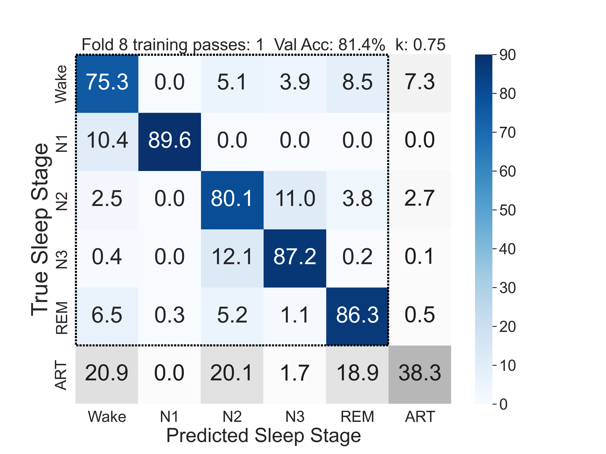

# NIDRA 
### Neural Inferencer for Deep Rest Analysis
<br>

Advanced neural networks can perform highly accurate sleep scoring, but these technologies are often difficult to implement. 

NIDRA is a fool-proof, simple-to-use tool for scoring sleep recordings using the best currently available autoscoring machine learning algorithms. No programming required, but a CLI and python endpoints are available. 

NIDRA can be downloaded as a standalone executable file, without installing anything (useful in restricted environments), but is also pip installable, or by downloading this repository.

NIDRA can autoscore data from polysomnography (PSG) recordings, as well as from sleep EEG wearables (such as ZMax). 

NIDRA enables anyone, including researchers without any programming experience, to use cutting-edge sleep scoring models.

NIDRA by default uses the highly accurate U-Sleep 2.0 model for PSG, and the recently validated high-accuracy ez6 and ez6moe sleep scoring models for ZMax data and simliar sleep EEG wearables. For a validation of the ez models see https://www.biorxiv.org/content/10.1101/2025.06.02.657451v1


<br>

# Usage:

NIDRA can be used without installation using portable, ready-to-go executables:

Linux: LINK

MacOS: LINK

Windows: LINK


## Installation

Alternatively, NIDRA can be installed by cloning this github repository:

1.  **Clone the repository:**

    ```bash
    git clone https://codeberg.org/pzerr/NIDRA.git
    cd NIDRA
    ```

2.  **Create and activate a virtual environment:**

    On macOS and Linux:
    ```bash
    python3 -m venv .venv
    source .venv/bin/activate
    ```
    
    On Windows:
    ```bash
    python -m venv .venv
    .venv\Scripts\activate
    ```

3.  **Install the package:**
    
    ```bash
    pip install .
    ```


Or, (in the near future), from PyPI:

```bash
pip install NIDRA
```


# Graphical User Interface:

The GUI provides an intuitive way to score sleep recordings. To launch the GUI, run the portable executable (see above),

or run the following command in your terminal after installation:

```bash
nidra-gui
```

<br>

<br>
Fig.1 - Screenshot of the GUI
<br>
<br>


# Model Validation:

### ez6 and ez6moe

ez6 is the first accurate autoscoring model for 2-channel forehead sleep EEG devices, such as the ZMax.

ez6moe is multiple-expert model and a variant of ez6. It is accurate on the level of the interrater agreement between human scorers. 

<br>

<br>
Fig.2 - Confusion matrix (vs. manually scored PSG) of the artefact-aware ez6moe model 
<br>
<br>

### U-Sleep

For U-Sleep models see https://www.nature.com/articles/s41746-021-00440-5


<br>
<br>


# **Manual:**

1.  **Input Directory**: Select the directory containing the sleep recording data.
2.  **Output Directory**: Select the directory where the results will be saved. This defaults to a new folder in the Input Directory.
3.  **Scoring Mode**:
    *   **Score single recording**: Scores a single recording in the selected input directory.
    *   **Score all subdirectories**: Scores all recordings in the subdirectories of the selected input directory.
4.  **Data Source**:
    *   **Forehead EEG**: For data from forehead EEG recordings.
    *   **PSG**: For data from PSG recordings.
5.  **Model**: Select the model to use for scoring. The available models depend on the selected data source.
6.  **Options**:
    *   **Generate Plots**: Generate plots of the sleep stages.
    *   **Generate Statistics**: Generate statistics of the sleep stages, such as WASO, sleep efficiency, etc.
7.  **Run**: Start the scoring process.


**Example:**

```python
import NIDRA
from pathlib import Path

# --- EEG wearable example ---
forehead_input_file = Path('test_data_zmax/EEG_L.edf')
forehead_output_dir = Path('test_data_zmax/autoscoring_output')

forehead_scorer = NIDRA.scorer(
    scorer_type='forehead',
    input_file=str(forehead_input_file),
    output_dir=str(forehead_output_dir),
    model_name='ez6'
)

forehead_hypnogram, forehead_probabilities = forehead_scorer.score(plot=True)


# --- PSG example ---
psg_input_file = Path('test_data_psg/sleeprecording.edf')
psg_output_dir = Path('test_data_psg/autoscoring_output')

psg_scorer = NIDRA.scorer(
    scorer_type='psg',
    input_file=str(psg_input_file),
    output_dir=str(psg_output_dir),
    model_name='u-sleep-nsrr-2024'
)

psg_hypnogram, psg_probabilities = psg_scorer.score(plot=True)


```


### Command-Line Interface (CLI)

The CLI is ideal for batch processing and integration into automated workflows.

**Command:**
```bash
nidra score [OPTIONS]
```

**Arguments:**

*   `--input_path`: Path to the input file (.edf) or a directory containing .edf files. (Required)
*   `--output_dir`: Path to the directory where the results will be saved. (Required)
*   `--scorer_type`: The type of scorer to use. (Required, choices: `psg`, `forehead`)
*   `--model_name`: The name of the model to use. (Optional)
*   `--no_plot`: If set, no plots will be generated. (Optional)

**Example:**

```bash
nidra score --input_path test_data_zmax/ --output_dir test_data_zmax/autoscoringoutput/ --scorer_type forehead --model_name ez6
```


## Citing

If you use NIDRA, please cite the following publication:

Coon WG, Zerr P, Milsap G, Sikder N, Smith M, Dresler M, Reid M. "ezscore-f: A Set of Freely Available, Validated Sleep Stage Classifiers for Forehead EEG." bioRxiv, 2025, doi: 10.1101/2025.06.02.657451.
https://www.biorxiv.org/content/10.1101/2025.06.02.657451v1


## Attribution

ez6 and ez6moe models were developed by Coon et al., see:
Coon WG, Zerr P, Milsap G, Sikder N, Smith M, Dresler M, Reid M.
"ezscore-f: A Set of Freely Available, Validated Sleep Stage Classifiers for Forehead EEG."
https://www.biorxiv.org/content/10.1101/2025.06.02.657451v1
github.com/coonwg1/ezscore

U-Sleep models were developed by  Perslev et al., see:
Perslev, M., Darkner, S., Kempfner, L., Nikolic, M., Jennum, P. J., & Igel, C. (2021).
U-Sleep: resilient high-frequency sleep staging. NPJ digital medicine
https://www.nature.com/articles/s41746-021-00440-5
https://github.com/perslev/U-Time

The U-Sleep model weights used in this repo were re-trained by Rossi et al., see:
Rossi, A. D., Metaldi, M., Bechny, M., Filchenko, I., van der Meer, J., Schmidt, M. H., ... & Fiorillo, L. (2025).
SLEEPYLAND: trust begins with fair evaluation of automatic sleep staging models. arXiv preprint arXiv:2506.08574.
https://arxiv.org/abs/2506.08574v1


## License

This project is licensed under the MIT License. See the [LICENSE](LICENSE) file for details.

## Author

Paul Zerr (zerr.paul@gmail.com)
